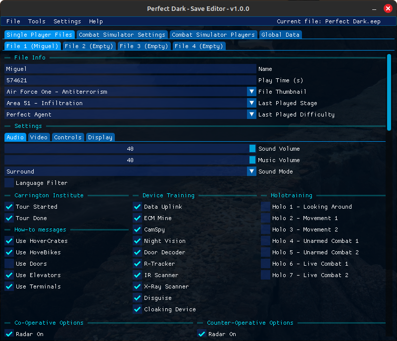
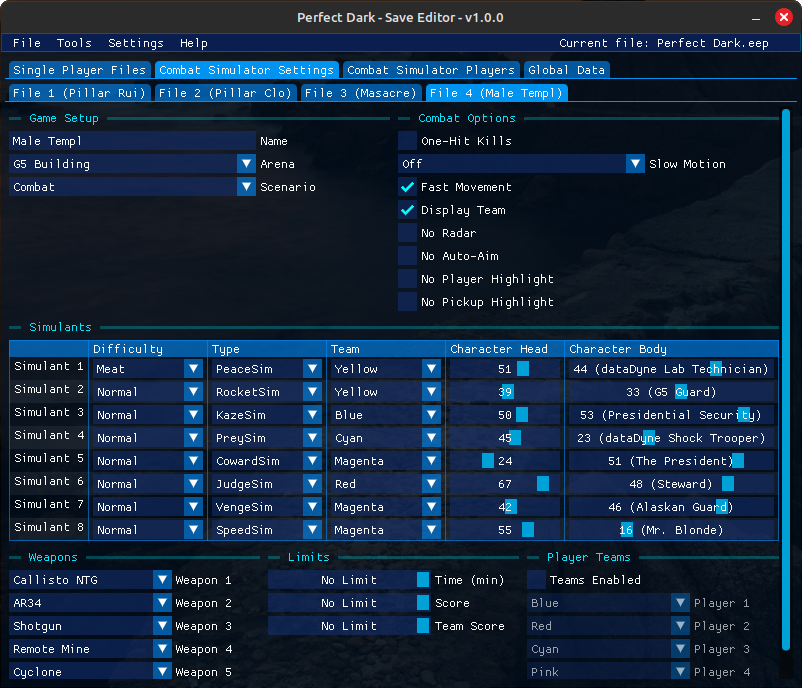
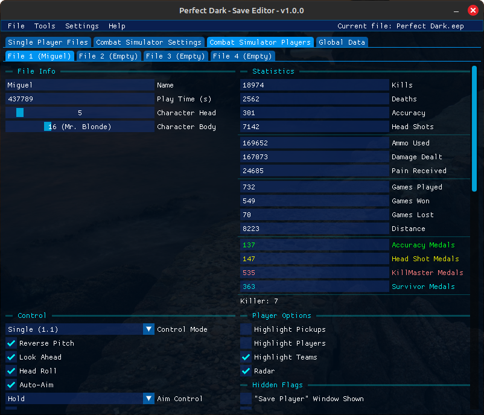
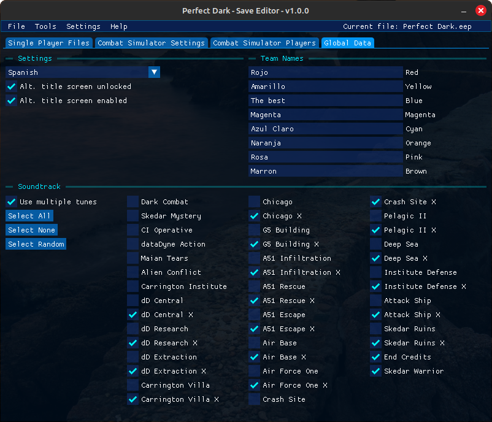

# Perfect Dark - Save Editor

This is a Perfect Dark cross-platform save editor. It is able to edit everything of a save file from both the Nintendo 64 and PC versions of the game.

## Requirements

The program runs on Windows and Linux and requires a GPU compatible with OpenGL 3.3.

## Features

- It can edit save files from both the Nintendo 64 and PC versions of the game.
- It can copy and delete save slots.
- It can convert a save file's format from Nintendo 64 to PC and vice versa.

## Changelog

You can check the changelog [here](https://github.com/MaikelChan/PDSaveEditor/blob/main/CHANGELOG.md).

## Screenshots

